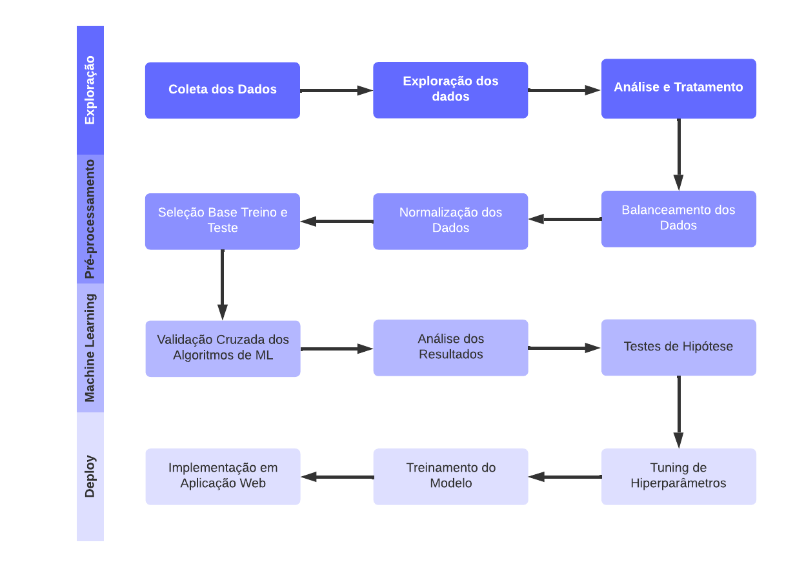
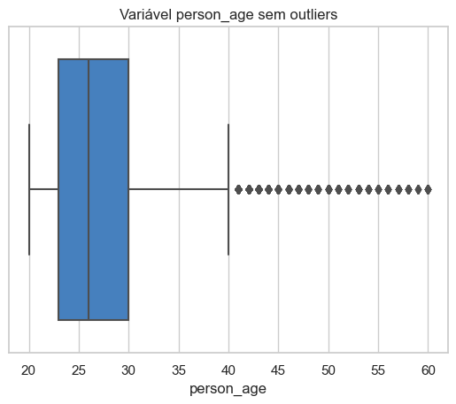
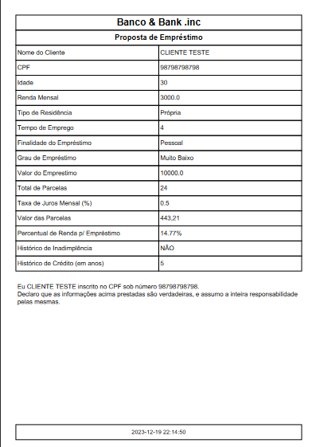

# Previsão de Risco de Crédito com Python

## Objetivo:
Este projeto tem como principal objetivo a criação de um modelo de machine learning eficiente, voltado para a previsão de casos de inadimplência entre os clientes que buscam empréstimos junto a uma instituição financeira.

Um objetivo secundário consiste no desenvolvimento de uma aplicação web que apresente uma interface amigável para os usuários. Essa aplicação integrará o modelo de machine learning desenvolvido, permitindo que os usuários consultem a avaliação de crédito de forma prática e rápida.

Dessa forma, ao utilizar a aplicação, os usuários receberão um feedback imediato sobre a aprovação ou não do seu pedido de empréstimo, facilitando o processo de tomada de decisão e proporcionando uma experiência mais eficiente e acessível.

>Disclaimer: a empresa mencionada na contextualização do problema de negócio é fictícia e os dados usados neste projeto são públicos.

## Arquivos do Projeto:

- [Jupyter Notebook (Análise e Criação do Modelo ML)](./Previsao_Risco_de_Credito.ipynb)
- [Código Fonte da Aplicação Web](./app.py)
- [Modelos de ML Criados](./modelos/)
- [Base de Dados](./dados/)
- [Imagens](./img/)
- [License](./LICENSE)

## Aplicação Web:

>Clique na imagem para abrir o app CreditInspector ML v1.0.

[](https://previsaoriscodecreditocompython-3f2jtcmglfeytir2pbig4k.streamlit.app/)

## Sobre o Dataset:
O conjunto de dados usado neste projeto foi o [Credit Risk Dataset](https://www.kaggle.com/datasets/laotse/credit-risk-dataset), ele contem dados que simulam uma agência de crédito.

<details>
<summary><b>Descrição do conjunto de dados do risco de crédito:</b></summary>

||Variável|Descrição|
|---|---|---|
|1|person_age|Idade do cliente|
|2|person_income|Rendimento anual do cliente|
|3|person_home_ownership|Tipo de moradia: RENT, MORTGAGE, OWN e OTHER|
|4|person_emp_length|Duração do emprego do indivíduo em anos|
|5|loan_intent|Intenção de empréstimo: EDUCATION, PERSONAL, MEDICAL, VENTURE, HOMEIMPROVEMENT e DEBTCONSOLIDATION|
|6|loan_grade|Grau do empréstimo:A, B, C, D, E, F e G|
|7|loan_amnt|Montante do empréstimo|
|8|loan_int_rate|A taxa de juros associada ao empréstimo|
|9|loan_status|Estado do empréstimo: 0- pagou e 1- não-pagou|
|10|loan_percent_income|Porcentagem do emprestimo sobre a renda|
|11|cb_person_default_on_file|Incumprimento histórico: Y-tem um historico e N-não tem historico|
|12|cb_preson_cred_hist_length|Duração do historial de crédito|

</details>

## Contextualização:
<p>A instituição financeira <b>Banco & Bank</b> deseja otimizar seu processo de concessão de empréstimos, buscando reduzir as perdas causadas por inadimplência. Atualmente, o processo de avaliação de crédito é predominantemente manual, o que pode levar a decisões subjetivas e falhas na identificação de clientes de alto risco.</p>
<p>O desafio é implementar um sistema de análise de crédito baseado em machine learning para prever a probabilidade de inadimplência de um cliente antes da concessão do empréstimo. O objetivo é aprimorar a precisão na identificação de clientes que têm maior probabilidade de não honrar com seus compromissos financeiros.</p>

## Desenvolvimento do Projeto:

### Checklist:

- [X] Exploração, Análise e Tratamento de Ouliers.
- [X] Pré-processamento de Dados.
- [X] Modelagem Preditiva.
- [X] Validação do Modelo.
- [X] Implementação em Produção.

### Workflow do Projeto:



### Ferramentas Utilizadas:
Na implementação deste projeto usamos as ferramentas relacionadas abaixo:
- [Python 3.11.5](https://docs.python.org/pt-br/3.11/)
    - [Pandas](https://pandas.pydata.org/docs/)
    - [Numpy](https://numpy.org/doc/)
    - [Matplotlib](https://matplotlib.org/stable/index.html)
    - [Seaborn](https://seaborn.pydata.org/)
    - [Pickle](https://docs.python.org/pt-br/3/library/pickle.html)
    - [Scikit learn](https://scikit-learn.org/stable/user_guide.html)
    - [Streamlit](https://docs.streamlit.io/)
    - [PyFPDF](https://pyfpdf.readthedocs.io/en/latest/)
    - [Warnings](https://docs.python.org/pt-br/3/library/warnings.html)
- [Jupyter Notebook](https://docs.jupyter.org/en/latest/)
- [Visual Studio Code](https://code.visualstudio.com/docs)
- [Figma](https://www.figma.com/)

## Funções:
Funções criadas para auxiliar nas tarefas.
<details>
<summary><b>Função agrupa_dados():</b></summary>

- ENTRADAS:
    - dados, `DataFrame`: base de dados.
    - variavel, `str`: coluna da base de dados.
    - intervalo, `list`: lista com intervalos para agrupamento das informações.
    - agrupamento, `str`: nome do agrupamento que será criado.
- SAÍDA:
    - dados_agrupados,`DataFrame`: tabela em formato DataFrame.

```
def agrupa_dados(dados:pd.DataFrame,variavel:str,intervalo:list,agrupamento:str) -> pd.DataFrame:
    '''Agrupa os dados de um atributo por intervalos e retorna um pandas.DataFrame'''
    # Lista para armazenar os resultados
    resultados = []
    
    tamanho = len(intervalo)
    
    for x in range(0, tamanho - 1):
        proximo = intervalo[x] + 1
        num_pessoa = dados[variavel].between(proximo, intervalo[x + 1]).sum()
        resultados.append({agrupamento: f'{proximo} - {intervalo[x + 1]}', 'Contagem Total': num_pessoa})

    # Criar DataFrame
    dados_agrupado = pd.DataFrame(resultados)

    return dados_agrupado
```
</details>
<details>
<summary><b>Função validacao_cruzada():</b></summary>

- ENTRADAS:
    - classificador, `classifier`: recebe o algoritmo de classificação.
    - base_treino_x, `list[list[list]]`: recebe uma matriz com os dados de treino X.
    - base_treino_y, `list[list[list]]`: recebe uma matriz com os dados de treino Y.
- SAÍDA:
    - validacao, `dict`: retorna um dicionário com os dados de validação.
```
def validacao_cruzada(algoritmo, base_treino_x:list[list[list]],base_treino_y:list[list[list]]) -> dict:
    '''Retorna um dicionário com as pontuações das metricas apontadas no cross_validate.'''
    accuracy = []
    precision = []
    recall = []

    for i in range(10):
        kfold = KFold(n_splits=5, shuffle=True, random_state=i)
        scores = cross_validate(algoritmo, base_treino_x, base_treino_y, cv=kfold,
                                   scoring=['accuracy', 'precision', 'recall'])
        accuracy.append(scores['test_accuracy'].mean())
        precision.append(scores['test_precision'].mean())
        recall.append(scores['test_recall'].mean())

    resultados = {'accuracy':accuracy, 'precision':precision, 'recall':recall}

    return resultados
```
</details>
<details>
<summary><b>Função matriz_confusao():</b></summary>

- ENTRADA:
    - cm, `array`: recebe um array `confucion_matrix`.
- SAÍDA:
    - None
```
def matriz_confusao(cm:np.array) -> None:
    '''Retorna o gráfico da matriz de confusão.'''
    plt.figure(figsize=(6,4))
    sns.heatmap(cm, annot=True, fmt='d', cmap='Blues', cbar=False)
    plt.xlabel('Previsão')
    plt.ylabel('Real')
    plt.title('Matriz de Confusão')
    plt.show()
```
</details>

## 1. Exploração, Análise e Tratamento de Ouliers:
Identificar e compreender as variáveis e os dados da base e remover valores atípicos.

#### 1.1. Exploração e Análise dos Dados:
<details>
<summary><b>Distribuição dos dados da variável alvo.</b></summary>

Visualizando os dados da variável alvo loan_status.
```
sns.set(style='whitegrid')
ax = sns.countplot(x = dados.loan_status, palette=['#1d4f86', '#83b1e3'])
ax.bar_label(ax.containers[0], fontsize=10)
plt.show()
```


Visualizando proporções dos dados loan_status.

```
dados['loan_status'].value_counts().plot.pie(autopct='%1.1f%%', startangle=90, colors=['#1d4f86', '#83b1e3'])
plt.title('Proporção dos Dados da Coluna loan_status')
plt.ylabel("")
plt.legend(loc='upper right')
plt.show()
```

</details>
<details>
<summary><b>Total de clientes por faixa etária.</b></summary>

```
# Intervalos de idades
idades = [0, 18, 26, 36, 46, 56, 66]

# Criando dataframe
idades_agrupadas = agrupa_dados(dados, 'person_age', idades, 'Faixa Etária')

# Visualizando os dados
plt.figure(figsize=(8,6))
sns.set(style='whitegrid')
ax = sns.barplot(idades_agrupadas, x='Faixa Etária', y='Contagem Total', palette=['#1d4f86'])
ax.bar_label(ax.containers[0], fontsize=10)
plt.title('Total de Clientes Por Faixa Etária')
plt.show()
```

</details>
<details>
<summary><b>Total de clientes por faixa de renda.</b></summary>

```
# Intervalos de renda anual
renda = [0, 25000, 50000, 70000, 100000, float('inf')]

# Criando dataframe
renda_agrupada = agrupa_dados(dados, 'person_income', renda, 'Faixa de Renda')

# Plotar o gráfico de barras
plt.figure(figsize=(8,6))
sns.set(style='whitegrid')
ax = sns.barplot(renda_agrupada, x='Faixa de Renda', y='Contagem Total', palette=['#1d4f86'])
ax.bar_label(ax.containers[0], fontsize=10)
plt.title('Total de Cientes Por Faixa de Renda')
plt.show()
```

</details>
<details>
<summary><b>Total de clientes por faixa de valor de empréstimo.</b></summary>

```
# Intervalos de emprestimos
emprestimo = [0, 5000, 10000, 20000, 35000]

# Criando dataframe
emprestimo_agrupado = agrupa_dados(dados, 'loan_amnt', emprestimo, 'Faixa de Emprestimo')

# Visualizando gráfico
plt.figure(figsize=(8,6))
sns.set(style='whitegrid')
ax = sns.barplot(emprestimo_agrupado, x='Faixa de Emprestimo', y='Contagem Total', palette=['#1d4f86'])
ax.bar_label(ax.containers[0], fontsize=10)
plt.title('Total de Clientes Por Faixa de Emprestimo')
plt.show()
```

</details>
<details>
<summary><b>Distribuição de Status do Empréstimo por Faixa Etária.</b></summary>

```
# Copiando base
copia_dados = dados.copy()

# Criando faixas etárias
bins = [20, 25, 30, 35, 40, 45, 50, 55, 60]

# Adicionando uma coluna
copia_dados['faixa_etaria'] = pd.cut(copia_dados['person_age'], bins)

# Criando o gráfico de barras
plt.figure(figsize=(10, 6))
sns.set(style="whitegrid")
ax = sns.countplot(copia_dados, x='faixa_etaria', hue='loan_status', palette=['#1d4f86', '#83b1e3'])
ax.bar_label(ax.containers[0], fontsize=10)
ax.bar_label(ax.containers[1], fontsize=10)
plt.xlabel('Faixa Etária')
plt.ylabel('Contagem')
plt.title('Distribuição de Status do Empréstimo por Faixa Etária')
ax.set_xticklabels([f'{left} - {right}' for left, right in zip(bins[:-1], bins[1:])])
plt.legend()
plt.show()
```

</details>
<details>
<summary><b>Distribuição de Status do Empréstimo por Faixa de Renda Anual.
</b></summary>

```
# Copiando base
copia_dados = dados.copy()

# Criando faixas renda
bins = [0, 25000, 50000, 70000, 100000, float('inf')]

# Adicionando uma coluna ao DataFrame
copia_dados['faixa_renda'] = pd.cut(copia_dados['person_income'], bins)

# Criando o gráfico de barras
plt.figure(figsize=(10, 6))
sns.set(style="whitegrid")
ax = sns.countplot(copia_dados, x='faixa_renda', hue='loan_status', palette=['#1d4f86', '#83b1e3'])
ax.bar_label(ax.containers[0], fontsize=10)
ax.bar_label(ax.containers[1], fontsize=10)
plt.xlabel('Faixa de Renda')
plt.ylabel('Contagem')
plt.title('Distribuição de Status do Empréstimo por Faixa de Renda Anual')
ax.set_xticklabels([f'{primeiro} - {segundo}' for primeiro, segundo in zip(bins[:-1], bins[1:])])
plt.legend()
plt.show()
```

</details>
<details>
<summary><b>Distribuição de Status do Empréstimo por Faixa de Empréstimo.</b></summary>

```
# Copiando base
copia_dados = dados.copy()

# Criando faixas emprestimo
bins = [0, 5000, 10000, 20000, 35000]

# Adicionando uma coluna ao DataFrame
copia_dados['faixa_emprestimo'] = pd.cut(copia_dados['loan_amnt'], bins)

# Criando o gráfico de barras
plt.figure(figsize=(10, 6))
sns.set(style="whitegrid")
ax = sns.countplot(copia_dados, x='faixa_emprestimo', hue='loan_status', palette=['#1d4f86', '#83b1e3'])
ax.bar_label(ax.containers[0], fontsize=10)
ax.bar_label(ax.containers[1], fontsize=10)
plt.xlabel('Faixa de Emprestimos')
plt.ylabel('Contagem')
plt.title('Distribuição de Status do Empréstimo por Faixa de Empréstimo')
ax.set_xticklabels([f'{primeiro} - {segundo}' for primeiro, segundo in zip(bins[:-1], bins[1:])])
plt.legend()
plt.show()
```

</details>
<details>
<summary><b>Distribuição de Status do Empréstimo por Tipo de Imóvel.</b></summary>

```
# Criando gráfico
sns.set(style='whitegrid')
ax = sns.countplot(dados, x='person_home_ownership', hue='loan_status', palette=['#1d4f86', '#83b1e3'])
ax.bar_label(ax.containers[0], fontsize=10)
ax.bar_label(ax.containers[1], fontsize=10)
plt.xlabel('Tipo de Imóvel')
plt.ylabel('Contagem')
plt.title('Distribuição de Status do Empréstimo por Tipo de Imóvel')
plt.legend()
plt.show()
```

</details>
<details>
<summary><b>Distribuição de Status do Empréstimo por Histórico de Inadimplência.</b></summary>

```
# Criando gráfico
sns.set(style='whitegrid')
ax = sns.countplot(dados, x='cb_person_default_on_file', hue='loan_status', palette=['#1d4f86', '#83b1e3'])
ax.bar_label(ax.containers[0], fontsize=10)
ax.bar_label(ax.containers[1], fontsize=10)
plt.xlabel('Histórico de Inadimplência')
plt.ylabel('Contagem')
plt.title('Distribuição de Status do Empréstimo por Histórico de Inadimplência')
plt.legend()
plt.show()
```

</details>
<details>
<summary><b>Distribuição de Status do Empréstimo por Grau de Empréstimo.</b></summary>

```
# Criando gráfico
sns.set(style='whitegrid')
ax = sns.countplot(dados, x='loan_grade', hue='loan_status', palette=['#1d4f86', '#83b1e3'])
ax.bar_label(ax.containers[0], fontsize=10)
ax.bar_label(ax.containers[1], fontsize=10)
plt.xlabel('Grau de Empréstimo')
plt.ylabel('Contagem')
plt.title('Distribuição de Status do Empréstimo por Grau de Empréstimo')
plt.legend()
plt.show()
```

</details>
<details>
<summary><b>Distribuição de Status do Empréstimo por Finalidade.</b></summary>

```
# Criando gráfico
plt.figure(figsize=(15,6))
sns.set(style='whitegrid')
ax = sns.countplot(dados, x='loan_intent', hue='loan_status', palette=['#1d4f86', '#83b1e3'])
ax.bar_label(ax.containers[0], fontsize=10)
ax.bar_label(ax.containers[1], fontsize=10)
plt.xlabel('Finalidade do Empréstimo')
plt.ylabel('Contagem')
plt.title('Distribuição de Status do Empréstimo por Finalidade')
plt.legend()
plt.show()
```

</details>
<details>
<summary><b>Distribuição de Status do Empréstimo por Histórico de Crédito.</b></summary>

```
# Criando gráfico
plt.figure(figsize=(15,6))
sns.set(style='whitegrid')
ax = sns.countplot(dados, x='cb_person_cred_hist_length', hue='loan_status', palette=['#1d4f86', '#83b1e3'])
ax.bar_label(ax.containers[0], fontsize=10)
ax.bar_label(ax.containers[1], fontsize=10)
plt.xlabel('Histórico de Crédito')
plt.ylabel('Contagem')
plt.title('Distribuição de Status do Empréstimo por Histórico de Crédito')
plt.legend()
plt.show()
```

</details>

#### 1.2. Tratamento de Outliers:
<details>
<summary><b>Variável person_age.</b></summary>

- Retirando registros acima de 60 anos.
```
dados = dados.drop(dados[dados['person_age'] > 60].index, axis=0)
```
- Visualizando boxplot person_age.
```
sns.boxplot(x=dados['person_age'], color='#327fd2')
plt.title('Variável person_age sem outliers')
plt.show()
```

</details>
<details>
<summary><b>Variável person_income.</b></summary>

- Retirando registros acima de 140.000
```
dados = dados.drop(dados[dados['person_income'] > 140000].index, axis=0)
```
- Visualizando boxplot person_income
```
sns.boxplot(x=dados['person_income'], color='#327fd2')
plt.title('Variável person_income sem outliers')
plt.show()
```

</details>
<details>
<summary><b>Variável person_emp_length.</b></summary>

- Retirando registros acima de 30 anos.
```
dados = dados.drop(dados[dados['person_emp_length'] > 30].index, axis=0)
```
- Visualizando boxplot person_emp_length.
```
sns.boxplot(x=dados['person_emp_length'], color='#327fd2')
plt.title('Variável person_emp_length sem outliers')
plt.show()
```

</details>

## 2. Pré-processamento dos Dados:

<details>
<summary><b>2.1. Balanceamento dos dados:</b></summary>

- Separando dados de maioria e minoria:
```
status_0 = dados_final[dados_final['loan_status'] == 0]
status_1 = dados_final[dados_final['loan_status'] == 1]
```
- Definindo valor para n_samples:
```
n_samples = len(status_0)
n_samples
```
- Balanceamento do atributo:
```
status_1_balanceada = resample(status_1, replace=True, n_samples=n_samples)
```
- Base balanceada:
```
dados_balanceados = pd.concat([status_0, status_1_balanceada])
```
- Visualizando dados balanceados da variável alvo:
```
ax = sns.countplot(x=dados_balanceados['loan_status'], palette=['#1d4f86', '#83b1e3'])
ax.bar_label(ax.containers[0], fontsize=10)
plt.title('Dados Balanceados')
plt.show()
```

</details>
<details>
<summary><b>2.2. Pré-processamento dos Dados Originais:</b></summary>

- Separando variável alvo e variáveis de classificação:
```
# Definindo base de atributos
X = dados_final.drop('loan_status', axis=1)

# Definindo base da variável de objetivo
Y = dados_final.iloc[:,8].values
``` 
- Aplicando OneHotEncoder
```
# Criando o ColumnTransformer
onehotencoder_x = ColumnTransformer(transformers=[('OneHot', OneHotEncoder(), [0, 2, 4, 5, 9, 10])],
                                   remainder='passthrough')

# Aplicando a transformação
X_encoded = onehotencoder_x.fit_transform(X).toarray()
```
- Aplicando StandardScaler:
```
# Cria o StandardScaler
scaler_x_encoded = StandardScaler()

# Aplica a transformação
X_encoded = scaler_x_encoded.fit_transform(X_encoded)
```
- Divisão da base em treino e teste:
```
# Criando base de Treino e Teste
x_treino, x_teste, y_treino, y_teste = train_test_split(X_encoded, Y, test_size=0.20, random_state=1)
```
</details>
<details>
<summary><b>2.3. Pré-processamento dos Dados Balanceados:</b></summary>

- Separando variável alvo e variáveis de classificação:
```
# Definindo base de atributos
X_balanceado = dados_balanceados.drop('loan_status', axis=1)

# Definindo base da variável de objetivo
Y_balanceado = dados_balanceados.iloc[:,8].values
```
- Aplicando OneHotEncoder
```
# Criando o ColumnTransformer
onehotencoder_x_balanceado = ColumnTransformer(transformers=[('OneHot', OneHotEncoder(), [0, 2, 4, 5, 9, 10])],
                                               remainder='passthrough')

# Aplicando a transformação
X_balanceado_encoded = onehotencoder_x.fit_transform(X_balanceado).toarray()
```
- Aplicando StandardScaler:
```
# Cria o StandardScaler
scaler_x_balanceado_encoded = StandardScaler()

# Aplica a transformação
X_balanceado_encoded = scaler_x_balanceado_encoded.fit_transform(X_balanceado_encoded)
```
- Divisão da base em treino e teste:
```
# Criando base de Treino e Teste
x_treino_balanceado, x_teste_balanceado, y_treino_balanceado, y_teste_balanceado = train_test_split(X_balanceado_encoded, Y_balanceado, test_size=0.20, random_state=1)
```
</details>

## 3. Modelagem Preditiva:

<details>
<summary><b>3.1 Criando Classificadores:</b></summary>

```
# Criando classificadores
random_forest = RandomForestClassifier()
svm = SVC()
logistic = LogisticRegression()
rna = MLPClassifier()
```
</details>
<details>
<summary><b>3.2 Avaliação Cruzada:</b></summary>

```
# Aplicando validação cruzada nos dados balanceados
random_forest_balanceado = validacao_cruzada(random_forest, x_treino_balanceado, y_treino_balanceado)
svm_balanceado = validacao_cruzada(svm, x_treino_balanceado, y_treino_balanceado)
logistic_balanceado = validacao_cruzada(logistic, x_treino_balanceado, y_treino_balanceado)
rna_balanceado = validacao_cruzada(rna, x_treino_balanceado, y_treino_balanceado)

# Aplicando validação cruzada nos dados originais
random_forest_normal = validacao_cruzada(random_forest, x_treino, y_treino)
svm_normal = validacao_cruzada(svm, x_treino, y_treino)
logistic_normal = validacao_cruzada(logistic, x_treino, y_treino)
rna_normal = validacao_cruzada(rna, x_treino, y_treino)
```
- Distribuição dos valores de `accuracy` obtidos na avaliação.

```
# DataFrame com valores de accuracy dos modelos balanceados
accuracy_balanceado_df = pd.DataFrame({'RandomForest_balanceado':random_forest_balanceado['accuracy'],
                                       'SVM_balanceado':svm_balanceado['accuracy'],
                                       'RegressaoLogistica_balanceado':logistic_balanceado['accuracy'],
                                       'RNA_balanceado':rna_balanceado['accuracy']})

# DataFrame com valores de accuracy dos modelos normais
accuracy_normal_df = pd.DataFrame({'RandomForest_normal':random_forest_normal['accuracy'],
                                       'SVM_normal':svm_normal['accuracy'],
                                       'RegressaoLogistica_normal':logistic_normal['accuracy'],
                                       'RNA_normal':rna_normal['accuracy']})

# Visualizando distribuição dos modelos
fig, axs = plt.subplots(4, 2, figsize=(8, 14))

sns.kdeplot(accuracy_balanceado_df['RandomForest_balanceado'], ax=axs[0,0])
axs[0,0].set_title('RandomForest Balanceado')
sns.kdeplot(accuracy_normal_df['RandomForest_normal'], ax=axs[0,1])
axs[0,1].set_title('RandomForest Normal')

sns.kdeplot(accuracy_balanceado_df['SVM_balanceado'], ax=axs[1,0])
axs[1,0].set_title('SVM Balanceado')
sns.kdeplot(accuracy_normal_df['SVM_normal'], ax=axs[1,1])
axs[1,1].set_title('SVM Normal')

sns.kdeplot(accuracy_balanceado_df['RegressaoLogistica_balanceado'], ax=axs[2,0])
axs[2,0].set_title('RegressaoLogistica Balanceado')
sns.kdeplot(accuracy_normal_df['RegressaoLogistica_normal'], ax=axs[2,1])
axs[2,1].set_title('RegressaoLogistica Normal')

sns.kdeplot(accuracy_balanceado_df['RNA_balanceado'], ax=axs[3,0])
axs[3,0].set_title('Redes Neurais Balanceado')
sns.kdeplot(accuracy_normal_df['RNA_normal'], ax=axs[3,1])
axs[3,1].set_title('Redes Neurais Normal')

plt.tight_layout()
plt.show()
```

- Avaliando métricas das avaliações cruzadas:
```
# Avaliando as métricas dos modelos
resumo = pd.DataFrame(
    {'labels': ['accuracy', 'precision', 'recall'],
            'random_forest_balanceado': [
                random_forest_balanceado['test_accuracy'].mean(), 
                random_forest_balanceado['test_precision'].mean(), 
                random_forest_balanceado['test_recall'].mean()],
            'random_forest_normal': [
                random_forest_normal['test_accuracy'].mean(), 
                random_forest_normal['test_precision'].mean(), 
                random_forest_normal['test_recall'].mean()],
            'svm_balanceado': [
                svm_balanceado['test_accuracy'].mean(), 
                svm_balanceado['test_precision'].mean(), 
                svm_balanceado['test_recall'].mean()],
            'svm_normal': [
                svm_normal['test_accuracy'].mean(), 
                svm_normal['test_precision'].mean(), 
                svm_normal['test_recall'].mean()],
            'logistic_balanceado': [
                logistic_balanceado['test_accuracy'].mean(), 
                logistic_balanceado['test_precision'].mean(), 
                logistic_balanceado['test_recall'].mean()],
            'logistic_normal': [
                logistic_normal['test_accuracy'].mean(), 
                logistic_normal['test_precision'].mean(), 
                logistic_normal['test_recall'].mean()],
            'rna_balanceado': [
                rna_balanceado['test_accuracy'].mean(), 
                rna_balanceado['test_precision'].mean(), 
                rna_balanceado['test_recall'].mean()],
            'rna_normal': [
                rna_normal['test_accuracy'].mean(), 
                rna_normal['test_precision'].mean(), 
                rna_normal['test_recall'].mean()]}).set_index('labels')


resumo = resumo.transpose()
resumo.style.applymap(lambda x: 'background-color: #abcaec' if x >= 0.80 else '')
```

```
# Criando um gráfico para visualização
fig, ax = plt.subplots(figsize=(15, 5))

# Adiciona barras para cada métrica
largura_barra = 0.25
barra_1 = range(len(resumo))
barra_2 = [pos + largura_barra for pos in barra_1]
barra_3 = [pos + largura_barra for pos in barra_2]

# Cores das barras
cores = {'accuracy':'#1d4f86', 'precision':'#5a98db', 'recall':'#abcaec'}

ax.bar(barra_1, resumo['accuracy'], width=largura_barra, label='accuracy', color=cores['accuracy'])
ax.bar(barra_2, resumo['precision'], width=largura_barra, label='precision', color=cores['precision'])
ax.bar(barra_3, resumo['recall'], width=largura_barra, label='recall', color=cores['recall'])

# Adiciona rótulos
ax.set_xticks([pos + largura_barra for pos in barra_1])
ax.set_xticklabels(['RandoForest_b', 'RandoForest_n', 'SVM_b', 'SVM_n',
                   'Logistic_b', 'Logistic_n', 'RNA_b', 'RNA_n'])
ax.set_xlabel('Modelos')
ax.set_ylabel('Pontuações')
ax.set_title('Desempenho dos Modelos')
ax.legend()
plt.show()
```

</details>
<details>
<summary><b>3.3. Testes de Hipóteses ANOVA e Tukey:</b></summary>

- ANOVA:

```
# ANOVA teste
_, p = f_oneway(random_forest_balanceado['accuracy'],svm_balanceado['accuracy'], logistic_balanceado['accuracy'],
                rna_balanceado['accuracy'],random_forest_normal['accuracy'],svm_normal['accuracy'], 
                logistic_normal['accuracy'],rna_normal['accuracy'])

# Definindo alpha em 0.05, indica que o teste terá uma confiabilidade de 95%
alpha = 0.05

# Rejeitando a hipótese nula
if p <= alpha:
    print('Hipótese nula rejeitada. Dados são diferentes')
else:
    print('Hipótese alternativa rejeitada. Resultados são iguais')
```
- Tukey:

```
# preparando base para teste
lista = [
    model + '_' + condition
    for model in ['random', 'svm', 'logistic', 'rna']
    for condition in ['balanceado', 'normal']
    for _ in range(10)
]

resultado_algoritmos = {'Accuracy':np.concatenate([random_forest_balanceado['accuracy'], random_forest_normal['accuracy'],
                                                  svm_balanceado['accuracy'], svm_normal['accuracy'],
                                                  logistic_balanceado['accuracy'], logistic_normal['accuracy'],
                                                  rna_balanceado['accuracy'], rna_normal['accuracy']]),
                       'Algoritmo':lista}
resultado_algoritmos = pd.DataFrame(resultado_algoritmos)

# Aplicando teste de multiplas comparações
compara_algoritmos = MultiComparison(resultado_algoritmos['Accuracy'], resultado_algoritmos['Algoritmo'])

# Teste estatístico
teste_estatistico = compara_algoritmos.tukeyhsd()
print(teste_estatistico)

# Visualizando o melhor modelo
teste_estatistico.plot_simultaneous()
plt.show()
```

</details>

## 4. Validação do Modelo:

<details>
<summary><b>4.1 Tuning dos Parâmetros com Grid Search:</b></summary>

```
# Concatenando base de treino e teste balanceada
X_credit = np.concatenate((x_treino_balanceado, x_teste_balanceado), axis=0)
y_credit = np.concatenate((y_treino_balanceado, y_teste_balanceado), axis=0)

# Dimensões
X_credit.shape, y_credit.shape

# Hiperparâmetros
parametros = {
    'criterion':['gini', 'entropy'],
    'n_estimators':[10, 50, 100, 200],
    'min_samples_split':[2, 5, 10],
    'min_samples_leaf':[1, 5, 10]
}

# Criando objeto GridSearchCV
grid_search = GridSearchCV(estimator=RandomForestClassifier(), param_grid=parametros)

# Treinando modelo
grid_search.fit(X_credit, y_credit)

# Melhores hiperparâmetros
melhores_parametros = grid_search.best_params_

# Melhor acurácia
melhor_resultado = grid_search.best_score_

# Visualizando os resultados
print(melhores_parametros)
print(melhor_resultado)
```
`A precisão obtida: 98.29%.`

|Hiperparâmetros|Valores|
|---|---|
|criterion|entropy|
|n_estimators|100|
|min_samples_split|2|
|min_samples_leaf|1|
</details>
<details>
<summary><b>4.2. Criando Modelo:</b></summary>

- Treinando e gerando previsões:
```
# Criando modelos
modelo = RandomForestClassifier(criterion='entropy', n_estimators=200, min_samples_split=2,
                                min_samples_leaf=1, random_state=1)
modelo.fit(x_treino_balanceado, y_treino_balanceado)

# Criando previsões
previsoes = modelo.predict(x_teste_balanceado)
```
</details>
<details>
<summary><b>4.3. Accuracy:</b></summary>

```
print('Acurácia:', round(accuracy_score(y_teste_balanceado, previsoes), 2))
```
                Acurácia: 0.98
</details>
<details>
<summary><b>4.4. Confusion Matrix:</b></summary>

```
# Matriz de confusão
cm = confusion_matrix(y_teste_balanceado, previsoes)

# Grafico
matriz_confusao(cm)
```

</details>
<details>
<summary><b>4.5. Classification Report:</b></summary>

```
# Estatíticas do modelo
print(classification_report(y_teste_balanceado, previsoes))
```
                            precision    recall  f1-score   support

                            0       0.99      0.98      0.98      4848
                            1       0.98      0.99      0.98      4785

                     accuracy                           0.98      9633
                    macro avg       0.98      0.98      0.98      9633
                 weighted avg       0.98      0.98      0.98      9633
</details>
<details>
<summary><b>4.6. Modelo de Classificação para o Grau de Risco do Empréstimo:</b></summary>

- Carregando base de dados e balanceando as vareáveis de grau de empréstimo.
```
# Carregando base de dados
df = pd.read_csv('./dados/credit_risk_transformada.csv')

## Balanceando a base

# Separando dados de maioria e minoria
status_a = df[df['loan_grade'] == 'A']
status_b = df[df['loan_grade'] == 'B']
status_c = df[df['loan_grade'] == 'C']
status_d = df[df['loan_grade'] == 'D']
status_e = df[df['loan_grade'] == 'E']
status_f = df[df['loan_grade'] == 'F']
status_g = df[df['loan_grade'] == 'G']

# Definindo valor para n_samples
n_samples = len(status_a)
n_samples

# Balanceamento do atributo
status_b_balanceada = resample(status_b, replace=True, n_samples=n_samples)
status_c_balanceada = resample(status_c, replace=True, n_samples=n_samples)
status_d_balanceada = resample(status_d, replace=True, n_samples=n_samples)
status_e_balanceada = resample(status_e, replace=True, n_samples=n_samples)
status_f_balanceada = resample(status_f, replace=True, n_samples=n_samples)
status_g_balanceada = resample(status_g, replace=True, n_samples=n_samples)

# Base balanceada
df_balanceado = pd.concat([status_a, status_b_balanceada, status_c_balanceada,status_d_balanceada,
                          status_e_balanceada,status_f_balanceada,status_g_balanceada])
```
- Normalizando a base de dados balanceada:
```
# Separando as variaveis
X = df_balanceado.drop(['loan_status', 'loan_grade'], axis=True)
y = df_balanceado.iloc[:,5].values

## Normalização dos dados

# Criando o ColumnTransformer
onehotencoder = ColumnTransformer(transformers=[('OneHot', OneHotEncoder(), [0, 2, 4, 8])],
                                               remainder='passthrough')

x_enconded = onehotencoder.fit_transform(X).toarray()

# Cria o StandardScaler
scaler = StandardScaler()

# Aplica a transformação
x_credit = scaler.fit_transform(x_enconded)
```
- Criando modelo:
```
# Separando base de teste e treino
x_treino, x_teste, y_treino, y_teste = train_test_split(x_credit, y, test_size=0.2, random_state=1)

# Criando modelo
modelo = RandomForestClassifier(criterion='entropy', n_estimators=200, min_samples_split=2,
                                min_samples_leaf=1, random_state=1)
modelo.fit(x_treino, y_treino)

# Criando previsões
previsoes = modelo.predict(x_teste)
```
- Avaliação do modelo:
```
# Acuracia do modelo
print('Acurácia:', accuracy_score(y_teste, previsoes))
```
        Acurácia: 0.9710726643598616

```
# Matriz de confusão
cm = confusion_matrix(y_teste, previsoes)

# Grafico
matriz_confusao(cm)
```


```
# Estatíticas do modelo
print(classification_report(y_teste, previsoes))
```
                            precision    recall  f1-score   support

                        A       0.98      0.90      0.94      2089
                        B       0.88      0.98      0.93      2150
                        C       0.98      0.94      0.96      2052
                        D       0.98      0.97      0.97      2018
                        E       1.00      1.00      1.00      2045
                        F       1.00      1.00      1.00      2025
                        G       1.00      1.00      1.00      2071

                 accuracy                           0.97     14450
                macro avg       0.97      0.97      0.97     14450
             weighted avg       0.97      0.97      0.97     14450


</details>

## 5. Desenvolvimento da Aplicação Web e Deploy do Modelo:
>O deploy foi realizado na [Streamlit Community Cloud](https://docs.streamlit.io/streamlit-community-cloud), que é uma plataforma aberta e gratuita para a comunidade implementar, descobrir e partilhar aplicações e código Streamlit entre si.

### Sobre a Aplicação:
O aplicativo desenvolvido tem o nome de CreditInspector ML, trat-se de um aplicativo web projetado para simplificar o processo de aprovação de empréstimos por meio do uso de machine learning. Ele visa fornecer uma análise rápida e precisa das solicitações de empréstimo, automatizando a decisão de aprovação ou rejeição.

### Workflow App CreditInspector ML


### Link da Aplicação:

- [Aplicação Web](https://previsaoriscodecreditocompython-3f2jtcmglfeytir2pbig4k.streamlit.app/)

### Funcionalidades Principais:

1. **Interface Amigável**:
O aplicativo tem uma interface intuitiva para que os usuários possam facilmente preencher as informações dos clientes que solicitão empréstimo.

2. **Machine Learning**:
O CreditInspector ML integra modelos de machine learning treinados para analisar e prever a probabilidade de inadimplência e o grau de risco do empréstimo, com base nos dados fornecidos.

3. **Análise de Risco**:
O aplicativo avalia automaticamente o risco associado a cada solicitação de empréstimo, considerando fatores como histórico de crédito, renda, emprego, idade, e outros indicadores relevantes.

4. **Tomada de Decisão Automatizada**:
Com base na análise de risco, o CreditInspector ML tomará decisões automáticas sobre a aprovação ou rejeição do empréstimo.

5. **Feedback**:
Os usuários receberão feedback sobre a decisão da liberação ou não do empréstimo.

### Benefícios da Implementação do CreditInspector ML:

- **Eficiência**:
Processo rápido e automatizado.

- **Precisão**:
Decisões baseadas em análises detalhadas e preditivas.

- **Acessibilidade**:
Disponível a qualquer hora e em qualquer lugar com acesso à internet.

### Passo a Passo de Uso do App:
<details>
<summary><b>1. Informando Nome e CPF:</b></summary>

- Informe o nome completo do cliente e em seguida o cpf (apenas números).


</details>
<details>
<summary><b>2. Informando Data de Nascimento:</b></summary>

- Informe a data de nascimento digitando ou selecionando no calendário.


</details>
<details>
<summary><b>3. Informando Renda Mensal:</b></summary>

- Informar o valor da renda mensal digitando no campo indicado.


</details>
<details>
<summary><b>4. Informando Qual o Tipo de Residência:</b></summary>

- Selecione qual o tipo de residência, conforme as opções disponíveis.


</details>
<details>
<summary><b>5. Informando o Tempo de Trabalho:</b></summary>

- Use o deslizador para informar o total de anos de trabalho.


</details>
<details>
<summary><b>6. Informando Finalidade do Empréstimo:</b></summary>

- Selecione qual o tipo de finalidade do emprestimo, conforme as opções disponíveis.


</details>
<details>
<summary><b>7. Informando o Valor do Empréstimo:</b></summary>

- Informe o valor do emprestimo digitando no campo.


</details>
<details>
<summary><b>8. Informe a Taxa de Juros do Empréstimo:</b></summary>

- Use o deslizador para informar a taxa de juros.


</details>
<details>
<summary><b>9. Informe a Quantidade de Parcelas:</b></summary>

- Selecione a quantidade de parcelas, conforme as opções disponíveis.


</details>
<details>
<summary><b>10. Informe se Existe Histórico de Inadimplência:</b></summary>

- Selecione uma das duas opções, SIM para os casos que existem histórico de inadimplência e Não para o contrario.


</details>
<details>
<summary><b>11. Informe o Tempo de Crédito:</b></summary>

- Use o deslizador para informar a quantidade de anos de histórico de crédito.


</details>
<details>
<summary><b>12. Executando a consulta:</b></summary>

- Clique no botão "ANALISAR CRÉDITO".


- Exibindo resultado caso seja aprovado.


- Será habilitado o botão para exportar a proposta de empréstimo.


- O arquivo que será baixado será como esse.



- Na hipótese de ser reprovado o empréstimo, retornará a mensagem.


- Na situação de haver informações inválidas ou campos vazios, retornará a mensagem:


</details>


## Conclusão:
Diante do desafio representado pela taxa de inadimplência de aproximadamente **22%** que assolava a empresa, a aplicação eficaz do modelo de machine learning, que ostenta uma impressionante taxa de acerto de **98%** em suas previsões, emerge como uma promissora solução. 

Ao projetar a possível redução da taxa de inadimplência para **2%**, observamos uma transformação significativa no cenário financeiro. Em números concretos, considerando um faturamento de **1.000.000**, a atual perda seria de aproximadamente **220.000** proveniente da proporção de clientes inadimplentes, essa perda pode ser drasticamente mitigada para **20.000** com a implementação do modelo.

Essa notável redução de aproximadamente **91%**, não apenas ressalta a eficácia do novo sistema, mas também destaca sua capacidade de fortalecer substancialmente a saúde financeira da empresa. A estimativa de lucros que era de **780.000** passou a ser de **980.000** um ganho de **200.000**.

Portanto, a adoção desse modelo de machine learning não apenas representa uma resposta eficaz aos desafios de inadimplência, mas também promete um impacto positivo considerável nas finanças da empresa e posicionando-a em um caminho mais seguro e lucrativo para o futuro.
